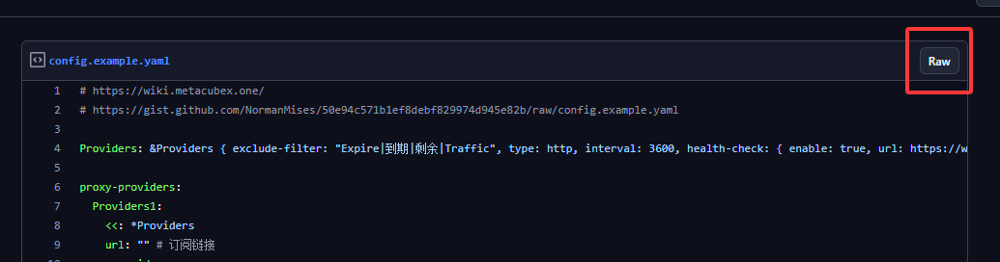

# mihomo 多端同步订阅
1. Fork [配置文件模板](https://gist.github.com/NormanMises/50e94c571b1ef8debf829974d945e82b)

2. 编辑 Fork 的配置文件，修改文件名为 `config.yaml`

3. 在 `config.yaml` 中 `proxy-providers` 添加自己的订阅

    [可选] 可以添加多个订阅，实现多个订阅里的节点合并到一起使用
    ```yaml
    provider1: # 订阅名称，自己修改，但不能重复
      <<: *Providers
      url: "" # 订阅地址
      override: # 给这个订阅里的所有节点前面加上这个前缀，不用可以删掉这两行
        additional-prefix: 'provider1 | ' # 给这个订阅里的所有节点前面加上这个前缀，不用可以删掉这两行
    ```
4. 保存修改后，点击 `config.yaml` 右上角的 `Raw` 按钮，得到配置文件的链接，类似 `https://gist.githubusercontent.com/NormanMises/50e94c571b1ef8debf829974d945e82b/raw/2c58b9a0bdfbf2f811010eb4698279d4bb7b446f/config.example.yaml`，删掉 `raw/` 与 `config.example.yaml` 之间的字符串，得到类似 `https://gist.githubusercontent.com/NormanMises/50e94c571b1ef8debf829974d945e82b/raw/config.example.yaml` 的链接，此链接即为你最终的配置文件链接

5. 最后即可把这个链接填入到所有使用 mihomo 内核的代理软件订阅中，实现多端同步配置。以后想修改配置，只需要修改 `config.yaml`，然后更新订阅即可

## Linux 无 GUI 配置
1. 下载 [mihomo 内核](https://github.com/MetaCubeX/mihomo/releases/latest) 最新版如 `mihomo-linux-amd64-v1.19.17.gz`，并解压，将解压后的文件名修改为 `mihomo`
5. 给 `mihomo` 添加执行权限
    ```bash
    chmod +x mihomo
    ```
6. 网络搜索 [gh-proxy](https://www.google.com/search?q=gh-proxy) 得到最新的 gh-proxy 地址，如 `https://gh-proxy.org/`，将 gh-proxy 地址与订阅链接拼接得到国内可以访问的订阅链接，如 `https://gh-proxy.org/https://gist.githubusercontent.com/NormanMises/50e94c571b1ef8debf829974d945e82b/raw/config.example.yaml`
4. 在 `mihomo` 同目录下创建 `start.sh`，内容如下，注意填入上一步中得到的国内可以访问的订阅链接
    ```bash
    unset http_proxy
    unset https_proxy

    wget "订阅链接" -O config.yaml

    ./mihomo -d .
    ```
5. 给 `start.sh` 添加执行权限
    ```bash
    chmod +x start.sh
    ```
6. 运行 `start.sh`
    ```bash
    ./start.sh
    ```
7. 要保证 `mihomo` 在后台运行，可以使用 `tmux` [参考](../config/README.md) 等工具挂在后台
8. http 代理默认为 `http://127.0.0.1:7890`，socks5 代理为 `socks5://127.0.0.1:7890`。端口为 `config.yaml` 中 `mixed-port` 字段
9. 在 `.bashrc` 中写入
    ```bash
    # Open proxy
    on() {
        export https_proxy="http://127.0.0.1:7890"
        export http_proxy="http://127.0.0.1:7890"
        echo "HTTP/HTTPS Proxy on"
    }

    # Close proxy
    off() {
        unset http_proxy
        unset https_proxy
        echo "HTTP/HTTPS Proxy off"
    }
    ```
    然后就可以用 `on` 和 `off` 在命令行中来使用代理了